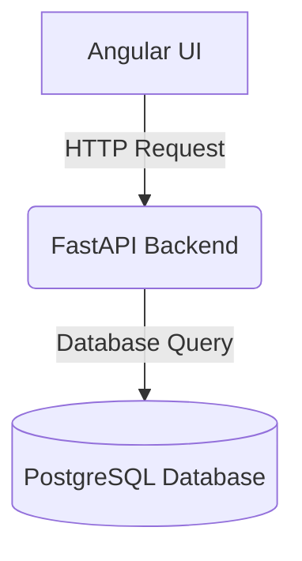
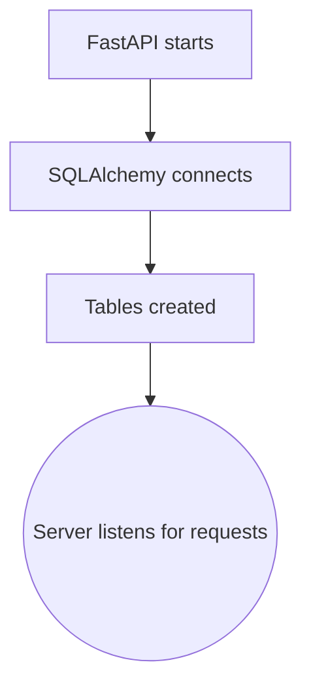
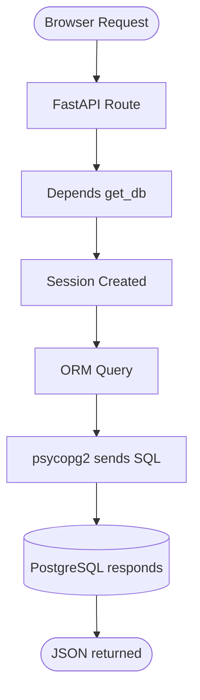

## Python env

### Node
- `node_modules/`
- `package.json`

### Python
- `venv/`
- `requirements.txt`

### Create Venv
```bash
python3 -m venv venv
```

### Activate Venv

**Windows (PowerShell or CMD):**
```powershell
.\venv\Scripts\activate
```

**Mac / Linux:**
```bash
source venv/bin/activate
```

**Note for Windows PowerShell Users:**
If you get an error stating that running scripts is disabled (`UnauthorizedAccess` / Execution Policy error), run this command once to allow scripts for your user account:
```powershell
Set-ExecutionPolicy RemoteSigned -Scope CurrentUser
```
Then try the activate command again.

### Common Commands

| Task | Command |
|---|---|
| Create env | `python -m venv venv` |
| Activate env | `.\venv\Scripts\activate` |
| Install package | `pip install fastapi` |
| Save deps | `pip freeze > requirements.txt` |
| Install deps | `pip install -r requirements.txt` |
| Run FastAPI | `uvicorn app.main:app --reload` |

# Database Architecture

## Big Picture Architecture


## What Happens Internally?


## Complete Request Flow

